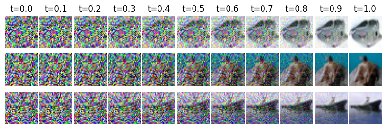
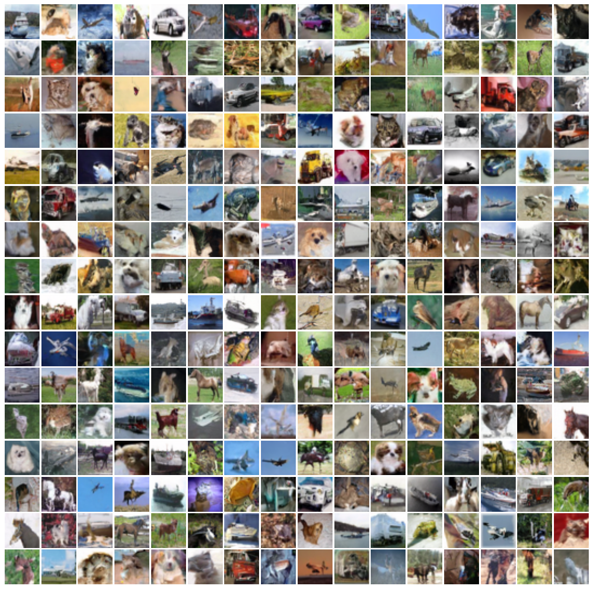

### Implementation of Flow Matching

https://arxiv.org/pdf/2210.02747

Results on CIFAR10 (60M parameters trained on 400 epochs, FID score: ~107):

Some more samples (unconditional):

The generated images are still inconsistent: For example some of the dog have a weird shape, and their eyes aren't symmetric. This partially explains the high FID score, the model could benefit from training a little bit more.

Results on the Checkerboard dataset:
