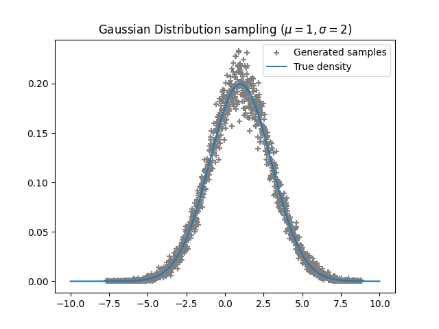

### Implementation of **Fast inverse transform sampling in one and two dimensions** 

Paper: https://arxiv.org/pdf/1307.1223

The goal is to generate samples from a given distribution in 1D and 2D

dependencies: numpy, scipy, matplotlib

### Examples

<table>
  <tr>
    <td></td>
    <td></td>
    <td></td>
  </tr>
  <tr>
    <td></td>
    <td></td>
    <td></td>
  </tr>
</table>
